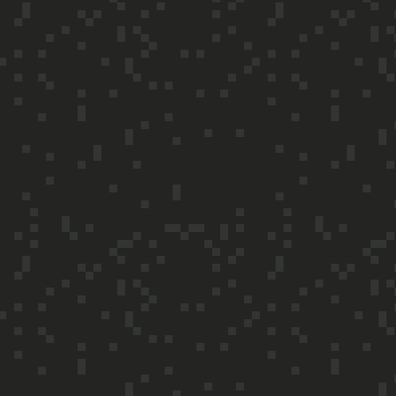

# SVG Background

A light weight tool for creating infinite SVG backgrounds.

# How to Use

1. Clone this repo and open `background.svg`

2. Edit the CSS styles at the top of `background.svg` as desired

3. See `index.html` as an example or add `background: url(background.svg)` to the body of your website

# Live Demo

Click [here](https://strawstack.github.io/SVG_Background/) for a live demo

# Example Patterns

With a few simple changes, you can make the patterns below. Use `css transitions` or `animations` for an even greater effect!

